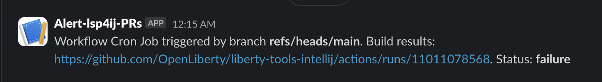

# Sending build results to the Slack channel

The job `call-build-workflow-slack-notification`, which is written at the end of the `cronJob.yaml` file, is responsible for sending build results as a Slack notification to the Slack channel `lsp4ij-monitoring`.

The job `call-build-workflow-slack-notification` runs after the jobs `call-build-workflow-for-lsp4ij-main-branch` and `call-build-workflow-for-each-merge-commit-sha` have completed. The notification provides information on whether the builds were successful or not.

#### How `call-build-workflow-slack-notification` works

* **Environment Variables** ( Prerequisite )
    - SLACK_WEBHOOK_URL: Secret containing the URL of the Slack webhook to send the notification to.
    - Slack App-Name →  **Alert-lsp4ij-PRs**
* **Determine Build Status**:
    - Retrieve the result of the **LSP4IJ main** branch build and the result of the **LSP4IJ PR** builds .
    - If all builds are successful, the build status will be `Success`. If any build fails, the build status will be `Failure`.
* **Send Slack Notification**:
  - The workflow uses curl to send a POST request to the `Slack webhook URL` with the build results.The message contains: the `workflow name`, the `branch` that triggered the workflow, a `link` to the workflow run on GitHub. The final status of the build.

By following these steps, this job ensures that a notification is sent to Slack about the status of the build process, indicating whether it succeeded or failed.

### This is how the slack message shows the build status

