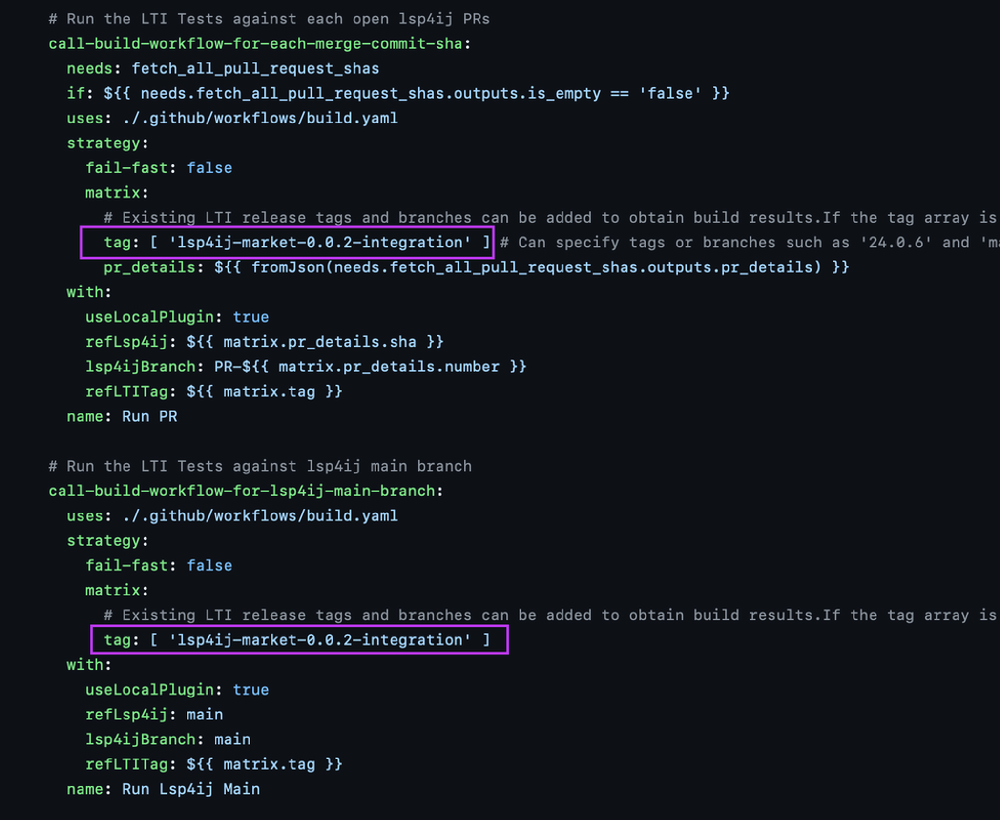

# How to specify LTI tags or branches in CI-CD builds

The **LTI Tags/Branches** must be specified in two locations within the `cronJob.yaml` file. 
These are used in two jobs: `call-build-workflow-for-each-merge-commit-sha` and `call-build-workflow-for-lsp4ij-main-branch`. 
There is a `tag` variable under the `matrix `that uses an array to store values. LTI tags or branches can be added to the tag array.

If an empty array ( `tag: ['']` ) is specified, the **LTI main branch** will be used. 

If builds for both the **LTI main branch** and specific **LTI tags** or **branches** are required, the tag array should contain the **main** branch in addition to the **LTI tag/branch**. For example, 

`tag: ['lsp4ij-market-0.0.2-integration', 'main']   `   

If **main** is not specified, the build and tests will not run for **LTI main**.

Multiple tags and branches can be specified like so:

`tag: ['24.0.3', '24.0.6', 'lsp4ij-market-0.0.2-integration', 'main']`